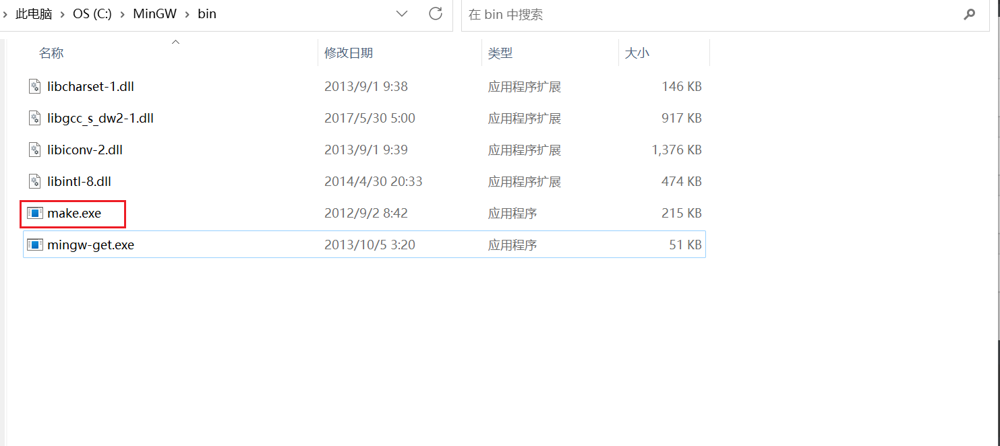

# Windows Platform

- scoop: 
- make: 
- NVS:
- pyenv-win:
- vs c++环境

## <a id="scoop">scoop</a>

安装scoop在命令行输入简单命令，可以安装软件，并且可以配置好相关配置文件。

scoop将安装到其默认位置(C:\Users<user>\scoop)

```shell
# cmd - 执行以下

Set-ExecutionPolicy RemoteSigned -Scope CurrentUser

irm get.scoop.sh | iex

# 执行 scoop help 验证

# scoop uninstall scoop  卸载
```

## make ( 执行makefile )

```python
一、安装并配置MinGW：

　　1.安装MinGW：https://sourceforge.net/projects/mingw/files/

　　2.把MinGW安装目录下的bin文件夹（D:\Application\MinGW\bin）添加到环境变量/系统变量/Path中

 

二、使用MinGW安装Make：

　　1.进入MinGW安装目录下的bin文件夹，运行“mingw-get.exe”

　　2.勾选四个名称带有“mingw32-make”的包，点击左上角的“Installation”，点击“Apply Changes”，点击“Apply”，如果下载出错，就重新Apply一次

　　3.进入MinGW安装目录下的bin文件夹，把“mingw32-make.exe”重命名为“make.exe”

　　4.在终端，执行以下命令 make -v，将出现Make版本信息：
```


也可以： make.exe download

```python
https://gnuwin32.sourceforge.net/packages/make.htm
```


## NVS - ( 安装和管理 node.js)

本地开发，经常快速更新或切换版本，社区有NVM， N等方案，推荐使用NVS

NVS是跨平台的

安装：

1. 由于 Windows 环境配置比较复杂，所以还是推荐使用 `msi` 文件完成初始化工作。

访问 [nvs/releases](https://link.zhihu.com/?target=https%3A//github.com/jasongin/nvs/releases) 下载最新版本的 `nvs.msi`，然后双击安装即可。

```shell
https://github.com/jasongin/nvs/releases
```

2. 或者用命令

```shell
winget install jasongin.nvs
# 这个也可以 choco install nvs
```

3. 安装node

```shell
nvs add latest # 安装最新版本
nvs add lts

Downloading [###########################################################################################] 100%
Extracting  [###########################################################################################] 100%
PATH += $env:LOCALAPPDATA\nvs\node\19.8.1\x64


# 使用一个node版本
$ nvs use lts
PATH += $env:LOCALAPPDATA\nvs\node\18.15.0\x64
# 增加到路径
$ nvs link lts

opentrons 配置版本呢
nvs add 16
nvs link 16
nvs ls  # 查看所有版本
```

4. nvs命令

   | Command                          | Description                              |
   | -------------------------------- | ---------------------------------------- |
   | `nvs help <command>`             | Get detailed help for a command          |
   | `nvs install`                    | Initialize your profile for using NVS    |
   | `nvs uninstall`                  | Remove NVS from profile and environment  |
   | `nvs --version`                  | Display the NVS tool version             |
   | `nvs add [version]`              | Download and extract a node version      |
   | `nvs rm <version>`               | Remove a node version                    |
   | `nvs migrate <fromver> [tover]`  | Migrate global modules                   |
   | `nvs upgrade [fromver]`          | Upgrade to latest patch of major version |
   | `nvs use [version]`              | Use a node version in the current shell  |
   | `nvs auto [on/off]`              | Automatically switch based on cwd        |
   | `nvs run <ver> <js> [args...]`   | Run a script using a node version        |
   | `nvs exec <ver> <exe> [args...]` | Run an executable using a node version   |
   | `nvs which [version]`            | Show the path to a node version binary   |
   | `nvs ls [filter]`                | List local node versions                 |
   | `nvs ls-remote [filter]`         | List node versions available to download |
   | `nvs link [version]`             | Link a version as the default            |
   | `nvs unlink [version]`           | Remove links to a default version        |
   | `nvs alias [name] [value]`       | Set or recall aliases for versions       |
   | `nvs remote [name] [value]`      | Set or recall download base URIs         |

5. 解释

   nvs管理软件版本，也就是node版本， node安装后用npm管理node.js包

## VS C++ build

安装Visual studio 2022，安装C++开发编译环境

## pyenv-win ( 安装和管理python )

安装管理不同版本python

1. 安装

```python
pip install pyenv-win

# pip uninstall pyenv-win

# 如果没有pip, 前往pyenv-win github
git clone https://github.com/pyenv-win/pyenv-win.git
```

2. 设置环境变量

```python
系统Path新增
%PYENV%\bin
%PYENV%\shims

# 新增环境变量
PYENV  C:\Soft\Python3_8\Lib\site-packages\pyenv-win
PYENV_HOME  C:\Soft\Python3_8\Lib\site-packages\pyenv-win
PYENV_ROOT  C:\Soft\Python3_8\Lib\site-packages\pyenv-win
```

3. pyenv install -l 可以列出所有可以安装的python版本

```python
pyenv install -l
```

4. 选择版本安装

```shell
pyenv install 3.7.9
```

5. 切换版本

```python
pyenv versions
pyenv global xxxx
```

6. 执行

```python
npm install --global yarn@1

make setup
```

## Windows平台Dev快速搭建

安装 make

---


- 安装makeinstaller

```shell
# ./Pack/mingw-get-setup.exe
安装make installer 
# 安装到 C:\MinGW
```

- 安装make package

```shell
# C:\MinGW\bin
1. 进入目录执行mingw-get.exe

2. 选择和make相关的package
```


- 安装完成


- 配置环境路径和变量

```shell
复制 C:\MinGW\bin 添加到用户环境变量
```


```python
# C:\MinGW\bin
更改文件名make为make.exe
```



- 查看版本

```shell
# cmd
make --version
```


搭建node环境

---

- 安装NVS

```shell
#./Pack/nvs-1.7.0.msi
安装msi文件
```

- 查看是否安装成功

```shell
nvs --version

# output = 1.7.0
```

- 安装node

```shell
# cmd
nvs add 16  # 安装opentrons node version
nvs link 16  # 使用当前版本
nvs ls # 查看已安装版本
```

C++编译环境

---

- 安装VS

  选择 Visual Studio Community 2022

- 点击修改

  安装C++开发环境

python环境

---

```shell
# C:/
git clone https://github.com/pyenv-win/pyenv-win.git # C盘clone pyenv for windows
```

- 新增环境变量

```shell
# 系统Path新增
%PYENV%\bin
%PYENV%\shims

# 新增环境变量, 根据安装目录设置
PYENV  C:\pyenv-win
PYENV_HOME  C:\pyenv-win
PYENV_ROOT  C:\pyenv-win
```


- 安装python

  ```shell
  pyenv install -l # 显示可以安装版本
  pyenv install 3.7.9 # 安装3.7
  pyenv versions # 查看所有安装版本
  pyenv global 3.7.9 # 切换系统版本
  pyenv local 3.7.9 
  
  ```

- 查看安装是否成功

  ```shell
  python --version
  
  # output = 3.7.9
  ```

安装gitbash

---

- 为什么安装gitbash

  make指令一般不是跨平台的，很多命令CMD终端并不是支持的很好，gitbash解释器可以执行linux平台命令

- 安装

```
# ./Pack/Git-2.40.0-64-bit.exe
1. 安装exe文件 -> C:/GitBash
```

执行push等make命令

---

1. 打开git bash

2. 进入项目目录

   

3. 执行目录

   ```shell
   cd hardware-testing
   npm install --global yarn@1
   
   make setup # 创建pipenv虚拟环境，安装python模块
   ```

4. 如何在VScode配置终端

   

# Linux Platform

- 配置yum源
- 安装git
- 安装pyenv
- 设置环境变量
- 安装python
- 安装nvs
- 安装node
- 拉代码
- 安装会造成报错的必要依赖（出线报错看这里装依赖）

## Linux (CentOS 8)

1. 配置yum源

   wget http://mirrors.aliyun.com/repo/Centos-8.repo

   yum makecache

2. 安装git

   yum -y install git

3. 安装pyenv

   ```shell
   git clone https://github.com/pyenv/pyenv.git ~/.pyenv
   ```

   ```shell
   yum install zlib-devel bzip2-devel openssl-devel ncurses-devel sqlite-devel readline-devel tk-devel gdbm-devel db4-devel libpcap-devel xz-devel -y  # 安装依赖
   ```

   

4. 设置环境变量

   ```
   #vim ~/.bashrc 
   export PYENV_ROOT="$HOME/.pyenv" 
   export PATH="$PYENV_ROOT/bin:$PATH" 
   eval "$(pyenv init -)"
   
   
   # source ~/.bashrc
   # exec bash
   ```

5. 安装python

   ```
   pyenv install 3.7.13  # 这一步需要外网连接
   
   
   pyenv global 3.7.13  # 切换到指定版本
   pyenv versions # 查看当前版本
   
   ```

6. 安装nvs 

   ```
   export NVS_HOME="$HOME/.nvs"
   git clone https://github.com/jasongin/nvs "$NVS_HOME"
   . "$NVS_HOME/nvs.sh" install
   
   
   nvs --version # 查看版本
   ```

7. 安装node.js 16

   ```
   nvs add 16
   nvs auto on
   
   nvs use 16  # 在当前shell使用 node
   ```

8. 拉代码

   centos 系统解除http验证 

   ```shell
   git config --global http.sslVerify "false"
   ```

   

   ```shell
   cd /
   git clone https://github.com/Opentrons/opentrons.git
   cd ./opentrons
   
   ```

9. 确保make已经安装

   ```shell
   yum install -y make
   
   make -v # 查看版本
   ```

10. 查看版本无误

    ```shell
    
    cd ./opentrons
    python --version
    node --version
    npm install --global yarn@1
    cd ./opentrons/hardware-testing
    make setup
    ```

11. 补充报错依赖

    ```shell
    出现没有pipenv 提前安装： pip install pipenv
    
    yum -y update gcc
    yum -y install gcc+ gcc-c++
    yum install "gcc-c++.x86_64" -y
    
    yum provides *# 查看缺失文件需要的依赖，然后安装
    yum install -y systemd-devel-239-51.el8.x86_
    
    # 出现mount is busy： 断掉所有机器ssh服务
    ```
    

## 


# Help

## windows push

1. 避免ssh公钥限制，增加opt参数


2. 配置git bash ssh config

   cd ~/.ssh

   touch config

   vi config

   

   ```
   Host *
   HostkeyAlgorithms +ssh-rsa
   PubkeyAcceptedKeyTypes +ssh-rsa
   
   ```

   

## hardware-testing

- make setup

  ```python
  python -m pipenv sync --dev --python 3.7
  python -m pipenv run pip freeze
  ```

  Note：执行一次就可以，重复执行会remove虚拟环境重新安装依赖

- make sync-sw-ot3

  ```makefile
  sync-sw-ot3:
  	cd ../hardware && $(MAKE) push-no-restart-ot3 host=$(host)
  	cd ../api && $(MAKE) push-no-restart-ot3 host=$(host)
  	cd ../shared-data && $(MAKE) all push-no-restart-ot3 host=$(host)
  	cd ../robot-server && $(MAKE) push-ot3 host=$(host)
  	cd ../hardware-testing && $(MAKE) push-all-ot3 host=$(host)
  ```

- push-no-restart-ot3

  function -> push-python-sdist

  ```makefile
  # push-python-sdist: push an sdist to an ot3
  # argument 1 is the host to push to
  # argument 2 is the identity key to use, if any
  # argument 3 is any further ssh options, quoted
  # argument 4 is the path to the sdist locally
  # argument 5 is the path to go to on the remote side
  # argument 6 is the python package name
  # argument 7 is an additional subdir if necessary in the sdist
  # argument 8 is either egg or dist (default egg)
  
  define push-python-sdist
  $(if $(is-ot3), ,echo "This is an OT-2. Use 'make push' instead." && exit 1)
  scp $(if $(2),"-i $(2)") $(scp-legacy-option-flag) $(3) $(4) root@$(1):/var/$(notdir $(4))
  ssh $(if $(2),"-i $(2)") $(3) root@$(1) \
  "function cleanup () { rm -f /var/$(notdir $(4)) ; rm -rf /var/$(notdir $(4))-unzip; mount -o remount,ro / ; } ;\
   mkdir -p /var/$(notdir $(4))-unzip ; \
   cd /var/$(notdir $(4))-unzip && tar xf ../$(notdir $(4)) ; \
   mount -o remount,rw / ; \
   rm -rf $(5)/$(6) $(5)/$(6)*.egg-info ; \
   mv /var/$(notdir $(4))-unzip/$(basename $(basename $(notdir $(4))))/$(if $(7),$(7)/)$(6) $(5)/ ; \
   mv /var/$(notdir $(4))-unzip/$(basename $(basename $(notdir $(4))))/$(if $(7),$(7)/)$(6)*.$(if $(8),$(8),egg)-info $(5)/$(basename $(basename $(notdir $(4)))).$(if $(8),$(8),egg)-info ; \
   cleanup \
   "
  endef
  ```

  call -> push-python-sdist

  ```makefile
  
  
  push-no-restart-ot3: sdist Pipfile.lock
  	$(call push-python-sdist,$(host),,$(ssh_opts),$(sdist_file),/opt/opentrons-robot-server,"opentrons_hardware")
  ```

  cmd

  ```makefile
  $ make -n push_test
  python -m pipenv run python setup.py sdist
  npx shx rm -rf build
  npx shx ls dist
  ssh: connect to host  port 22: Connection refused
  echo "This is an OT-2. Use 'make push' instead." && exit 1
  scp  -O   root@:/var/
  ssh   root@ "function cleanup () { rm -f /var/ ; rm -rf /var/-unzip; mount -o remount,ro / ; } ; mkdir -p /var/-unzip ; cd /var/-unzip && tar xf ../ ; mount -o remount,rw / ; rm -rf / /*.egg-info ; mv /var/-unzip// / ; mv /var/-unzip//*.egg-info /.egg-info ; cleanup "
  ```

  


